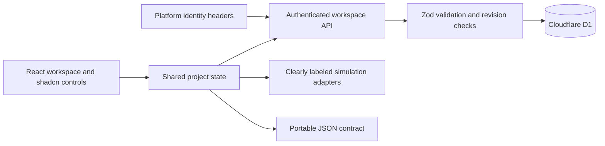

# Architect 2.0

A responsive product prototype for building agentic applications: one project, two ways of working. Guided mode starts with intent and preview; Developer mode opens editable example code and runtime logs.

## What works

- Platform sign-in, server-side authorization, per-user Cloudflare D1 persistence, schema validation, optimistic revision checks, save status, and JSON export.
- Create projects from prompts, edit the living blueprint, configure multi-framework agent teams, tools, model policies, approval boundaries, and per-run budgets.
- Interactive application preview with request submission, heading changes, design editing, example-code editing, and preview snapshot restoration.
- Saved demonstration records, knowledge metadata, membership records, workspace settings, usage budgets, and approval decisions.
- Searchable projects, command palette (Ctrl/Cmd K), templates, agent library, mobile navigation, workflow canvas, acceptance scenarios, deployment history, and trace/replay views.

## Deliberately simulated

AI code generation; repository fetching/import; OAuth connections; external model and tool execution; file upload/indexing/retrieval; generated-app identity providers; Git branches/pull requests; billing; generated-app deployment, DNS verification, and rollback. These flows are labeled in the interface. No real credentials are requested. The application does not claim to generate arbitrary production apps.

The Test lab checks the actual configured approval boundary. Other scenario results are illustrative. The automated tests in `tests/` exercise the real prototype UI and persistence; they are separate from those simulated product results.

## Run locally

Requires Node 22.13+ and npm. The browser test scripts use an installed Chrome browser.

```sh
npm ci
npm run build
npm run db:local
npm run dev
```

Open http://localhost:5173. The starter provides local sign-in through `/auth`. Production sign-in is owned by the Sites hosting dispatcher, which supplies trusted identity headers. Do not expose the worker behind a proxy that allows visitors to spoof those headers.

```sh
npm run lint
npm run typecheck
npm run test:security
npm run test:e2e
npm run test:audit
npm run test:resilience
npm run test:a11y
```

**E2E tests reset the local simulator's demo workspace.** Use a disposable local database; never redirect these tests to a live deployment. They are intentionally fixed to localhost. Screenshots and test output go to ignored `work/qa/`.

## Architecture



- `app/`: authenticated entry point, auth experience, and workspace API.
- `components/architect/`: domain model, workspace shell, project views, and feature flows.
- `db/` and `drizzle/`: schema, input validation, and generated migration.
- `tests/`: real browser regression and accessibility checks.
- `docs/`: feature map and quality assessment.

The workspace is stored as a bounded JSON document per authenticated user. This is appropriate for a prototype, with a 600 KB request limit and optimistic concurrency. It is not a collaborative database design for a production multi-tenant platform.

## Production continuation

Introduce normalized tenant/project membership, durable job queues, sandboxed builds, secure secret storage, framework adapters, GitHub App authorization, real model/tool execution, deployment-provider adapters, executable acceptance tests, OpenTelemetry traces, and audited human approvals. Keep the existing UI contract while replacing the simulation adapters.

Source repository: https://github.com/adminthelinkai/architect-2-studio.

## Audit iteration

The owner/user audit is in [docs/OWNER-AUDIT.md](docs/OWNER-AUDIT.md). New screens provide role-oriented onboarding, actual project-configuration JSON import/export, a Markdown engineering handoff, and an evidence ledger that distinguishes configuration from runtime verification. GitHub/ZIP source import remains simulated. Imported configuration is restored as a new draft with new IDs, cleared deployments, and reset scenario results.

Run `node tests/audit.mjs` against the disposable local development workspace to test the new journeys. The original 9/10 review was a prototype self-assessment; the audit provides a narrower comparative score and explicitly does not certify production readiness.

## Public demo and engineering audit

Anyone with a ChatGPT account can sign in to the public Site. Each user receives an independent saved workspace; public source visibility does not expose the workspace database. Google/GitHub/SSO identity flows remain demonstrations. Use Account → Sign out to end the session.

Read [the code audit](docs/CODE-AUDIT.md) and [security boundaries](SECURITY.md). Persistence is isolated in `use-workspace.ts`; HTTP input guards and atomic storage operations are small, separately tested modules. Failed loads gate editing; conflicts preserve a full-workspace export; unsaved state requests an exit warning. The sidebar prioritizes scrollable navigation over a compact usage indicator and closes on mobile navigation.

The GitHub Quality workflow runs static checks, security tests, dependency auditing, a production build, and all browser suites against a disposable local workspace. Local development uses the fixed preview identity and must not be exposed publicly.
